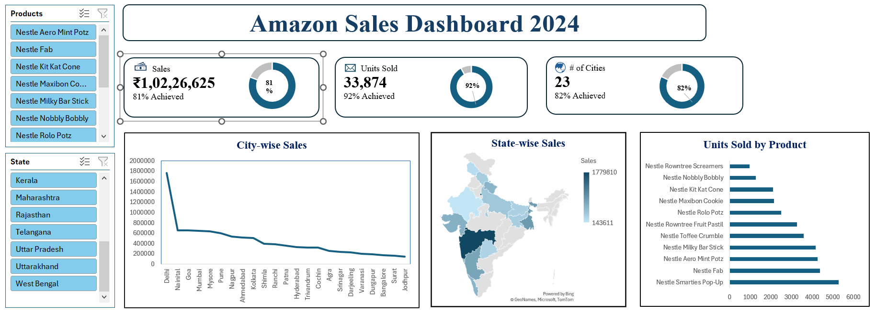

# Amazon Sales Dashboard (Excel Data Analysis Project)

## Project Overview
This project analyzes sales data using Microsoft Excel and presents insights through an interactive dashboard. The objective of this project is to understand sales performance, product demand, and regional sales trends.

## Dashboard Preview

## Dataset Information
The dataset contains sales transaction data with the following fields:

- Date
- Sales Representative
- Product
- Units Sold
- Price
- Total Sales
- City
- State
- Region
- Day of the Week

The dataset consists of 10,000 records.

## Project Workflow

1. Data Cleaning
The raw dataset was reviewed to ensure correct data types and remove inconsistencies.

2. Data Processing
Calculated fields and structured data were prepared for analysis.

3. Data Analysis
Sales trends were analyzed based on product category, region, and sales representatives.

4. Dashboard Creation
An interactive dashboard was created in Excel to visualize key metrics and insights.

## Dashboard Features

- Total Sales Overview
- Sales by Product
- Sales by Region
- Sales by State
- Sales Trends by Date
- Performance of Sales Representatives

## Tools Used

- Microsoft Excel
- Pivot Tables
- Pivot Charts
- Excel Dashboard Design

## Key Insights

- Identified top performing products
- Analyzed regional sales distribution
- Tracked sales performance across different time periods

## Files Included

Amazon_Sales_Dashboard.xlsx – Excel dashboard and dataset used for analysis.

## Author
Apala Debnath
